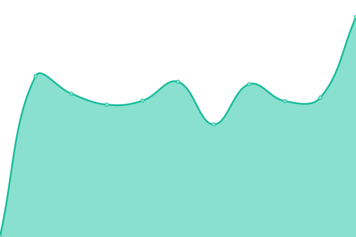
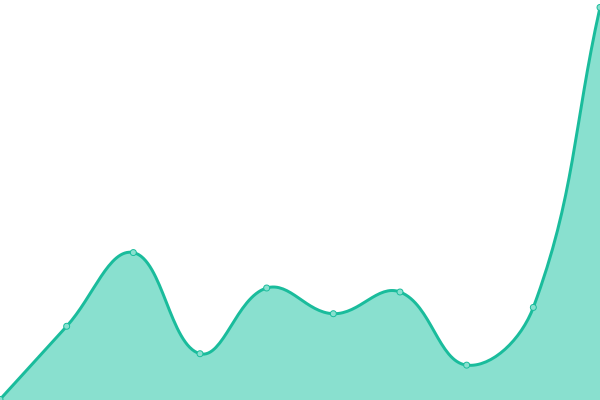
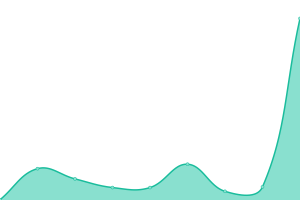
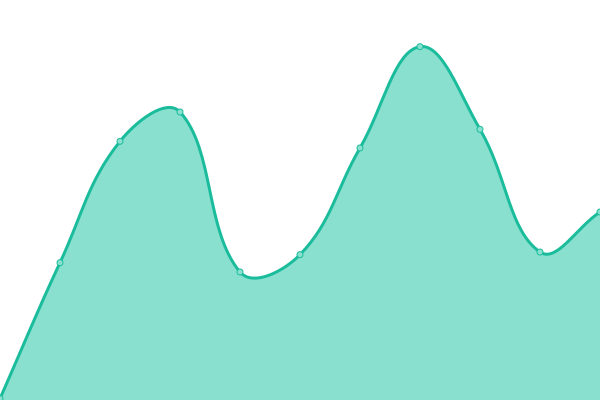

# [📈 Live Status](https://alivenotions.github.io/status.getfetch.io): <!--live status--> **🟧 Partial outage**

This repository contains the open-source uptime monitor and status page for [Fetch](https://getfetch.io), powered by [Upptime](https://github.com/upptime/upptime).

With [Upptime](https://upptime.js.org), you can get your own unlimited and free uptime monitor and status page, powered entirely by a GitHub repository. We use [Issues](https://github.com/alivenotions/status.getfetch.io/issues) as incident reports, [Actions](https://github.com/alivenotions/status.getfetch.io/actions) as uptime monitors, and [Pages](https://alivenotions.github.io/status.getfetch.io) for the status page.

<!--start: status pages-->
<!-- This summary is generated by Upptime (https://github.com/upptime/upptime) -->
<!-- Do not edit this manually, your changes will be overwritten -->

| URL                                          | Status  | History                                                                                                       | Response Time                                                                     | Uptime                                                                                                                                                                                                                           |
| -------------------------------------------- | ------- | ------------------------------------------------------------------------------------------------------------- | --------------------------------------------------------------------------------- | -------------------------------------------------------------------------------------------------------------------------------------------------------------------------------------------------------------------------------- |
| [Landing Page](https://getfetch.io)          | 🟩 Up   | [landing-page.yml](https://github.com/getfetch-io/status.getfetch.io/commits/master/history/landing-page.yml) |  674ms |  |
| [App](https://app.getfetch.io)               | 🟩 Up   | [app.yml](https://github.com/getfetch-io/status.getfetch.io/commits/master/history/app.yml)                   |  181ms          |                     |
| [API](https://api.getfetch.io)               | 🟥 Down | [api.yml](https://github.com/getfetch-io/status.getfetch.io/commits/master/history/api.yml)                   |  137ms          |                     |
| [Blog](https://blog.getfetch.io)             | 🟩 Up   | [blog.yml](https://github.com/getfetch-io/status.getfetch.io/commits/master/history/blog.yml)                 |  159ms         |                  |
| [App (staging)](https://staging.getfetch.io) | 🟩 Up   | [app-staging.yml](https://github.com/getfetch-io/status.getfetch.io/commits/master/history/app-staging.yml)   |  133ms  |    |
| [API (staging)](https://dev.getfetch.io)     | 🟥 Down | [api-staging.yml](https://github.com/getfetch-io/status.getfetch.io/commits/master/history/api-staging.yml)   |  150ms  |     |

<!--end: status pages-->

[**Visit our status website →**](https://alivenotions.github.io/status.getfetch.io)

## 📄 License

- Code: [MIT](./LICENSE) © [Bhavdeep Dhanjal](https://thinkspace.sh)
- Data in the `./history` directory: [Open Database License](https://opendatacommons.org/licenses/odbl/1-0/)
